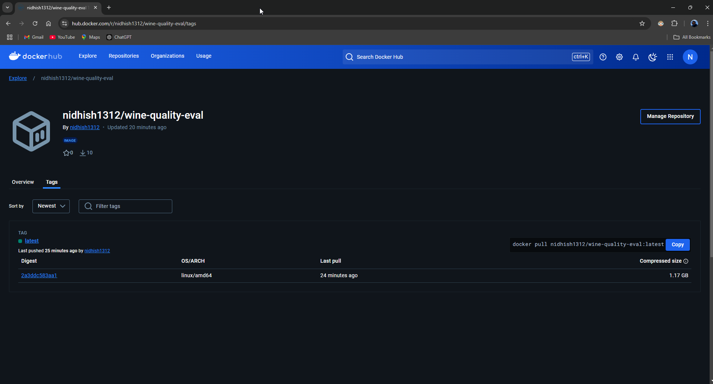

# CS643 Programming Assignment 2

---

## Docker Image Link
https://hub.docker.com/r/nidhish1312/wine-quality-eval/tags


---

## Instructions for Deployment

### 1. SSH into Instances
Use the following command to SSH into your 4 instances:
```bash
ssh -i /path/to/your/private-key.pem ubuntu@<instance-ip>
```
Repeat for all 4 instances.

---

### 2. Generate SSH Keys
On each instance, run:
```bash
ssh-keygen -t rsa -N "" -f /home/ubuntu/.ssh/id_rsa
```
Navigate to `.ssh` directory and verify:
```bash
cd ~/.ssh
ls -lrt
cat ~/.ssh/id_rsa.pub
```
Copy the output of `cat ~/.ssh/id_rsa.pub`.

---

### 3. Add Public Keys to `authorized_keys`
On each instance, run:
```bash
vim ~/.ssh/authorized_keys
```
Paste the public keys of all 4 instances into this file (one key per line).

---

### 4. Edit `/etc/hosts`
On each instance, update `/etc/hosts`:
```bash
sudo vim /etc/hosts
```
Add the following lines (replace `<ip-address>` with actual IPs):
```
<ip-address> nn
<ip-address> dd1
<ip-address> dd2
<ip-address> dd3
```

---

### 5. Install Java, Maven, and Spark
#### Install Java:
```bash
sudo apt update
sudo apt install openjdk-11-jdk -y
java -version
```

#### Install Maven:
```bash
sudo apt install maven -y
mvn -version
```

#### Install Spark 3.4.1:
```bash
wget https://archive.apache.org/dist/spark/spark-3.4.1/spark-3.4.1-bin-hadoop3.2.tgz
tar -xvzf spark-3.4.1-bin-hadoop3.2.tgz
echo "export SPARK_HOME=/home/ubuntu/spark-3.4.1-bin-hadoop3.2" >> ~/.bashrc
echo "export PATH=\$SPARK_HOME/bin:\$PATH" >> ~/.bashrc
source ~/.bashrc
```

---

### 6. Configure Spark Workers
Copy the `workers.template` to `workers`:
```bash
cp $SPARK_HOME/conf/workers.template $SPARK_HOME/conf/workers
```
Edit the `workers` file:
```bash
vim $SPARK_HOME/conf/workers
```
Add:
```
localhost
dd1/ip-address
dd2/ip-address
dd3/ip-address
```

---

### 7. Prepare Training and Evaluation Folders
On each instance:
```bash
mkdir ~/Training
mkdir ~/Eval
```
Place the corresponding Java code files inside these folders.

---

### 8. Run Training Code
Run the training code using `spark-submit`:
```bash
spark-submit --master spark://<master-ip>:7077 --class com.example.WineQualityEval /home/ubuntu/Training/wine-quality-train-1.0-SNAPSHOT.jar
```

---

### 9. Docker Setup
#### Dockerfile:
```dockerfile
FROM bitnami/spark:3.4.1
WORKDIR /app
COPY WineQualityEval /app/WineQualityEval
COPY WineQualityPredictionModel /home/ubuntu/WineQualityPredictionModel
COPY ValidationDataset.csv /home/ubuntu/ValidationDataset.csv
CMD ["spark-submit", "--master", "local", "--class", "com.example.WineQualityEval", "/app/WineQualityEval/target/wine-quality-eval-1.0-SNAPSHOT.jar"]
```

#### Build Docker Image:
```bash
sudo docker build -t nidhish1312/wine-quality-eval:latest .
```

#### Push Docker Image:
```bash
sudo docker login
sudo docker push nidhish1312/wine-quality-eval:latest
```

#### Pull Docker Image:
On each instance:
```bash
sudo docker pull nidhish1312/wine-quality-eval:latest
```

#### Run Docker Container:
```bash
sudo docker run -it --entrypoint /bin/bash nidhish1312/wine-quality-eval:latest
```

---

### 10. Run Spark Job in Docker
Run:
```bash
spark-submit --master spark://<master-ip>:7077 --class com.example.WineQualityEval /app/WineQualityEval/target/wine-quality-eval-1.0-SNAPSHOT.jar
```
---

## Results
F1 Score: 0.8104636591478698


